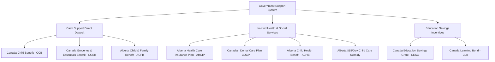

# Canadian Benefits Engine Architecture & Legal Principles

## 1. Statutory Grounding & Executive Overview
The Canadian income security system relies on a dual federal-provincial architecture administered predominantly through the **Canada Revenue Agency (CRA)** and provincial revenue departments (such as Alberta Treasury Board and Finance).

For newcomers immigrating to Alberta as Permanent Residents (PRs) from Saudi Arabia, benefit eligibility is governed by:
* The *Income Tax Act* (R.S.C., 1985, c. 1 (5th Supp.))
* CRA Guidelines T4114 (*Canada Child Benefit and related provincial programs*)
* *Alberta Child and Family Benefit Regulation* (Alta Reg 170/2019)
* *Health Insurance Premiums Act* and *Canada Health Act*

### The Zero-Assumption Mandate
Permanent Resident status alone does **not** create unconditional entitlement to financial payments. Benefit calculation is strictly contingent on:
1. Physical and legal establishment of Canadian tax residency.
2. Verified family worldwide net income for the current and prior two taxation years (declared via Form RC66SCH).
3. Number and verified ages of dependent children residing in the primary care of the applicant.
4. Annual filing of the Canadian T1 General Personal Income Tax Return by both spouses, regardless of whether Canadian income was earned.

---

## 2. Worldwide Income Conversion Protocol (SAR → CAD)
Under CRA newcomer rules, because benefits in Canada run on an annual cycle from **July 1 to June 30** based on the previous calendar year's earnings:
* An arriving family has not yet filed a prior-year Canadian tax return.
* The CRA establishes the baseline benefit rate by reviewing foreign income earned before arrival.
* For Yassir's family arriving from Riyadh, Saudi Arabia, income earned in Saudi Riyals (SAR) is translated into Canadian Dollars (CAD) using the Bank of Canada average exchange rate:
  $$\text{Income}_{\text{CAD}} = \text{Income}_{\text{SAR}} \times 0.3676 \quad (\text{or } \text{Income}_{\text{SAR}} \div 2.7204)$$
* Failure to submit Form RC66SCH results in an immediate suspension of benefit determination.

---

## 3. Benefit Categorization & The Non-Cash Separation Rule
To eliminate financial deception, all government programs are strictly delineated into:

* **Cash Benefits:** Deposited directly into the family chequing account tax-free; may be allocated toward household rent, groceries, or savings.
* **Non-Cash Subsidies:** Direct-to-provider subsidies (e.g., $15/day childcare, AHCIP hospital fees). They cannot be liquidated into household cash.

---

## 4. Maintenance & Audit Schedule
* **CCB & ACFB Formulas:** Recalibrated annually every July 1 to reflect national CPI inflation indexation.
* **CDCP & Dental Thresholds:** Audited quarterly (every 90 days).
* **Primary Source Authorities:**
  * CRA: [https://www.canada.ca/en/revenue-agency.html](https://www.canada.ca/en/revenue-agency.html)
  * Government of Alberta: [https://www.alberta.ca](https://www.alberta.ca)
