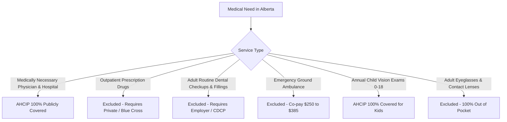

# Alberta Healthcare Coverage Audit & System Boundary Specification

## 1. Statutory Grounding: Alberta Health Care Insurance Plan (AHCIP)
The Alberta Health Care Insurance Plan (AHCIP) operates pursuant to the *Canada Health Act* and provincial regulations, providing universal public coverage for medically necessary physician and hospital services.

### The Zero-Day Waiting Period Rule
* **Statutory Rule:** In contrast to British Columbia and Ontario (which historically applied a 3-calendar-month waiting period), newcomers who establish permanent residence in Alberta directly from outside Canada are eligible for AHCIP **effective the exact date residency is established**.
* **The 3-Month Registration Mandate:** To secure retroactive coverage back to the landing date, the family must register with an authorized Alberta Registry Agent **within three (3) months** of arrival. Failing to register within 3 months can result in coverage beginning only on the date the completed application is approved.

---

## 2. In-Scope vs. Excluded Medical Services Matrix

### Comprehensive Coverage Boundary Audit

| Service Category | AHCIP Coverage Status | Typical Out-of-Pocket Cost (Without Private Insurance) | Recommended Coverage Solution |
| :--- | :--- | :--- | :--- |
| **Family Doctor / Walk-In Clinic Visits** | **100% Covered** ($0 co-pay) | $\$0$ | AHCIP Health Card |
| **Hospital Wards, Nursing & Surgeries** | **100% Covered** ($0 co-pay) | $\$0$ (Standard 4-bed ward) | AHCIP Health Card |
| **Emergency Room (ER) Triage & Care** | **100% Covered** ($0 co-pay) | $\$0$ | AHCIP Health Card |
| **Children's Annual Eye Exam (Ages 0–18)** | **100% Covered** ($0 co-pay) | $\$0$ | AHCIP (All 3 kids: 16, 11, 5) |
| **Adult Routine Eye Examination (19–64)** | **Excluded** (0% covered) | $\$80.00$ to $\$140.00$ | Employer Vision Care |
| **Adult Prescription Eyeglasses / Frames** | **Excluded** (0% covered) | $\$250.00$ to $\$600.00$ per pair | Employer Vision Care |
| **Outpatient Prescription Drugs (Pharmacies)** | **Excluded** (0% covered) | $\$30.00$ to $\$400.00+$ per refill | Employer Group Plan or Blue Cross Non-Group |
| **Adult Dental Cleanings & Fillings** | **Excluded** (0% covered) | $\$250.00$ to $\$450.00$ per visit | Employer Dental Plan / CDCP |
| **Emergency Ground Ambulance Transport** | **Excluded** (0% covered) | $\$250.00$ (treat no transport), $\$385.00$ (transported) | Employer Benefits / Non-Group |
| **Physiotherapy & Chiropractic (Outpatient)** | **Excluded** (0% covered) | $\$85.00$ to $\$135.00$ per session | Health Spending Account (HSA) |

---

## 3. Alberta Blue Cross Non-Group Coverage (Plan 118)
Before securing permanent corporate employment with group benefits, Yassir's family can obtain transitional bridge coverage through **Alberta Blue Cross Non-Group Coverage (Plan 118)**:

* **Monthly Premium:** $\$118.00$ CAD / month for full family coverage ($\$82.60$ CAD / month if subsidized).
* **Prescription Drug Benefit:** Patient pays a **30% co-payment**, capped at a maximum of **$\$35.00$ CAD per eligible prescription**.
* **Hospital Room Accommodation:** Covers the cost difference for semi-private or private rooms up to policy limits.
* **Ambulance Benefit:** Fully covers the provincial $\$250–\$385$ ground ambulance invoice.

---

## 4. Key Calgary Health Access Facilities
* **Nearest Hospital & Adult/Pediatric Emergency:** Peter Lougheed Centre (3500 26 Ave NE, Calgary).
* **Children's Specialized Emergency:** Alberta Children's Hospital (28 Oki Dr NW, Calgary).
* **24/7 Telephone Nurse Triage:** **Dial 811 (Health Link)** — Free confidential assessment with Arabic interpretation available.
